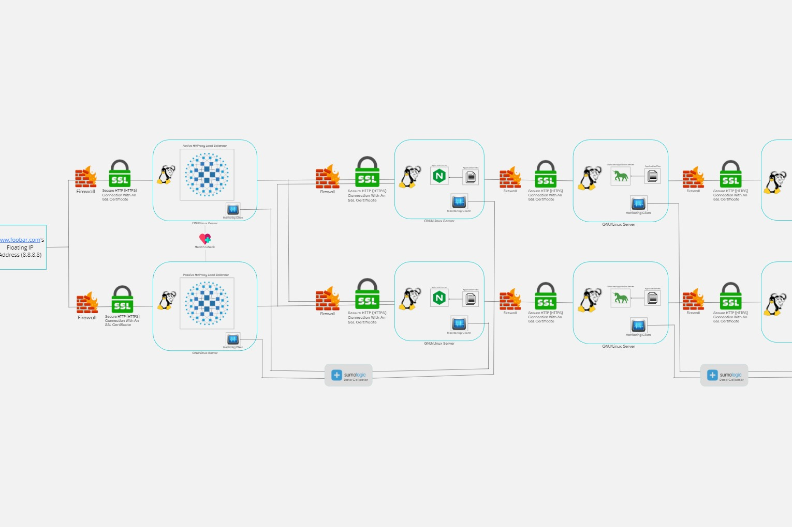

# Scaled Up Web Infrastructure

[Visit Board](https://miro.com/app/board/uXjVKdektaE=/)

## Description

This web infrastructure is a scaled up version of the infrastructure described [here](2-secured_and_monitored_web_infrastructure.md). In this setup, we've made sure there are no single points where everything can go wrong (SPOFs). Each important part, like the web server, application server and database servers, now have their own separate computers running on GNU/Linux. We're also keeping things secure by not stopping the SSL protection (which keeps our data safe) at the load balancer. Plus, each computer has its own firewall (like a security guard) to protect its network and we're keeping an eye on everything to make sure it stays safe.

## Specifics about this Infrastructure

+ The addition of a firewall between each server. This protects each server from unwanted and unauthorized users rather than protecting a single server.

## Possible issues that can arise with this Infrastructure

+ High maintenance costs. Moving each of the major components to its own server, means that more servers would have to be bought and the company's electricity bill would rise along with the introduction of new servers. Some of the company's funds would have to be used to buy the servers and pay for the electricity consumption needed to keep the servers (including the new and old ones) running.
